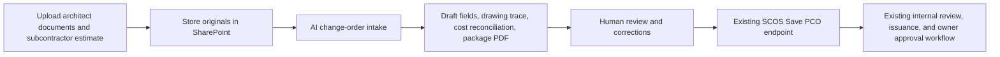

# SCOS AI-assisted PCO integration

Today, the skill does not directly connect to `scos.sebanksco.com`. It is a Codex workflow that defines how AI must inspect, trace, reconcile, and validate a change order. A small backend integration is needed to expose that workflow safely to the Change Orders page.



## Connection behavior

From `/change-orders`, start an **AI-assisted PCO** and upload or select:

- architect directive, ASI, RFI, sketches, or revised drawings;
- construction drawing set;
- subcontractor estimate and supporting quotes.

Store the documents in SharePoint. The verified July 2026 Change Order contract records stable SharePoint URLs, filenames, file hashes, categories, and notes; it does not upload file bytes through the Change Order draft payload.

Have a server-side AI intake worker apply this skill to:

- identify the architect-directed change;
- trace it to drawing sheet and detail/section;
- extract description and schedule impact;
- match the subcontractor estimate to affected scope;
- calculate subcontractor cost, GC markup, and proposed owner amount;
- identify conflicts, missing evidence, and rounding differences;
- produce the package PDF;
- return draft fields with source-file/page provenance and confidence.

Display the result in the existing Change Order form without saving automatically. Preserve user editing and require review. Keep schedule impact editable and require explicit confirmation when it is `0` days.

On **Save Draft**, use the existing authenticated route:

```text
POST /api/current/change-orders
```

That route creates the controlled SQL PCO record. Continue through the existing internal review, issuance, ownership approval, and PCO-to-OCO workflow.

## Existing contract and safety boundary

The present payload supports description, source reference, schedule impact, Buyout/commitment scope lines, cost components, GC markup, drawing pages, detail sections, specification sections, source URLs, and supporting attachments. Revalidate these source locations before implementation:

- `web-portal/public/change-orders.js`, form payload near line 338;
- `web-portal/src/change-order-normalization.js`, references near line 281;
- `web-portal/src/server.js`, save route near line 3003.

Return the AI result as a draft to the page. Keep the authenticated SCOS save route as the only record-creation authority. Do not let the AI write directly to SQL, approve an OCO, select ownership reviewers, assign budget adjustments, issue notifications, or post financial changes.

## Required implementation components

Add a server-side intake job that accepts authenticated ProjectID context and stable SharePoint item references, runs the evidence workflow, persists auditable provenance, and returns a normalized draft. Do not trust a model-supplied ProjectID, BuyoutUID, commitmentUID, reviewer, approval, or posting identifier.

Make intake asynchronous for large drawing packages. Expose job state and actionable failures without saving a PCO. Apply the completed result to the form, then require the normal **Save Draft** action.

Before calling the integration ready, test authorization, project isolation, malformed documents, unsupported files, inaccessible SharePoint items, timeouts, duplicate requests, conflicting totals, zero-day confirmation, missing Buyout lineage, reviewer suppression, and partial package-generation failure.

## Current TXM dependency

The last verified production portal reported that `TXM | Manor Microhospital` was not enabled for the controlled SQL Change Order workflow and returned no Buyout package, commitment, or owner reviewer choices. Resolve and verify that project configuration before a manual or AI-assisted PCO 11 can be saved.
